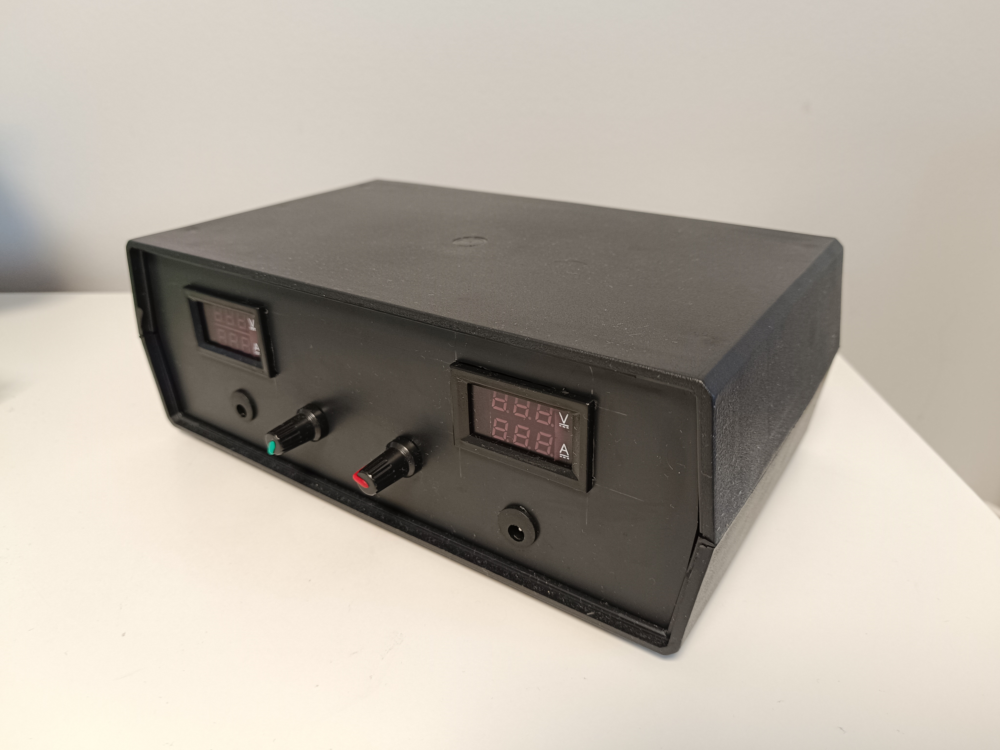

# Zasilacz stabilizowany regulowany

## Założenia projektowe
Założeniem projektu było skonstruowanie kompletnego dwukanałowego zasilacza stabilizowanego z płynną regulacją napięcia wyjściowego od 1.25 V do 12 V. Sprzętową realizację idei zasilacza oparto o scalony układ stabilizatora liniowego LM317. Z uwagi na dużą wydajność prądową stabilizatora należało uwzględnić rozproszenie wydzielającego się na nim ciepła. Zasilacz domyślnie powinien być wyposażony w potencjometryczną regulację napięcia wraz z jego graficzną reprezentacją na wyświetlaczu 7–segmentowym dołączonego miernika panelowego, a ponadto w rejestrację rzeczywistego poboru prądu przez obciążenie. Wyjście zasilacza przewidziano jako gniazda DC 2.1/5.5.
## Realizacja
Prace projektowe rozpoczęto od stworzenia schematu urządzenia wyłączając z niego transformator, jako element nienależący do zasadniczej części zasilacza. Na podstawie schematu zaprojektowano, a następnie samodzielnie wykonano płytkę PCB (metoda termotransferu), dla obu kanałów zasilacza. Do modułów dołączono zakupione wcześniej
mierniki panelowe oraz gniazda DC. Do wejścia podłączono transformator toroidalny o dwóch uzwojeniach wtórnych (2x15V; 1,67 A; 50VA). W trakcie jego zakupu musiano dobrać odpowiednio jego moc, tak, aby jako blok przed zasilaczem nie ograniczał jego możliwości dotyczących uzyskiwanej mocy. Jako chłodzenie pasywne zastosowano dwa płaskie radiatory przykręcone do obudowy LM317. W trakcie realizacji projektu zdecydowano się na dodanie do obwodu uzwojenia pierwotnego transformatora wyłącznika oraz bezpiecznika dla usprawnienia działania oraz poprawy bezpieczeństwa korzystania z urządzenia.
## Zasada działania
Zasilacz wykorzystuje działanie układu LM317, który pozwala za pomocą dzielnika rezystancyjnego dostrojenie napięcia wyjściowego. Dzięki zastosowaniu potencjometru regulacja ta odbywa się płynnie. Urządzenie jest podłączane do sieci 230 V następnie transformator obniża jego napięcie do 15 V RMS. Dalej jest ono „prostowane” oraz filtrowane i przekazywane do wejścia stabilizatora, który odpowiednią jego część przesyła na swoje wyjście tym samym na wyjście zasilacza. Minimalna wartość napięcia wyjściowego wynosi około 1,25 V. Związane jest to z napięciem dropout występującym jako spadek napięcia na stabilizatorze, niezbędnym do jego prawidłowej pracy. Górna granica napięcia jest różna dla obu kanałów: dla zielonego wynosi około 19 V natomiast dla czerwonego około 16 V. Maksymalny prąd wyjściowy zasilacza to około 1.5 A, jednak zgodnie z notą aplikacyjną stabilizatora jest on możliwy do uzyskania tylko jeżeli różnica napięć między wejściem a wyjściem układu jest mniejsza lub równa 15 V, czyli, gdy napięcie wyjściowe zasilacza jest większe niż około 5 V. W przeciwnym przypadku prąd maksymalny wynosi 400 mA.
## Zgodność z założeniami
Niestety ze względu na niedopatrzenie produkcyjne mierników panelowych tj. brak wlutowanego bocznika, nie udało się wykonać rejestracji pobieranego przez obciążenie zasilacza prądu. Nie spełniono również pierwotnego zakresu regulacji napięcia. Założenie w trakcie powstawania projektu uległo zmianie, z uwagi na wykorzystanie transformatora umożliwiającego uzyskanie wyższego napięcia wyjściowego. Zakresy napięcia są różne dla obu kanałów z uwagi na różnice konstrukcyjne poszczególnych elementów całego układu.
